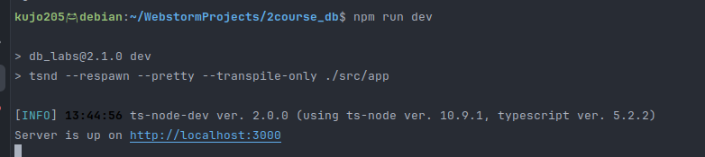
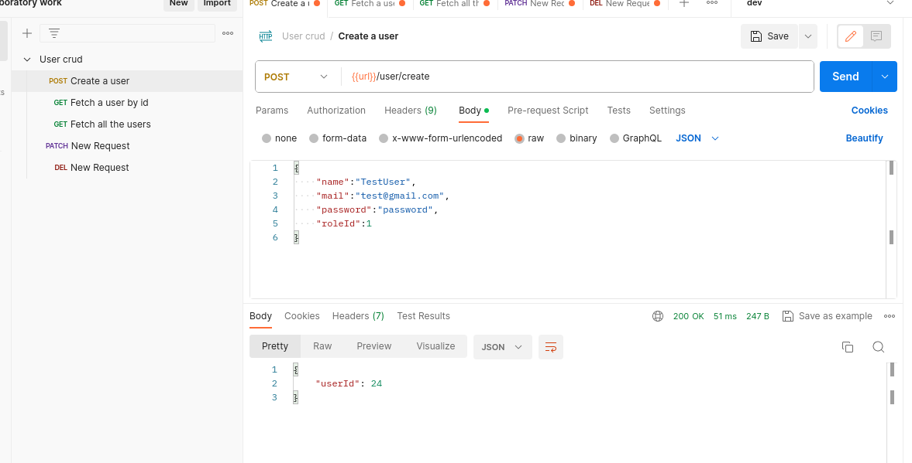
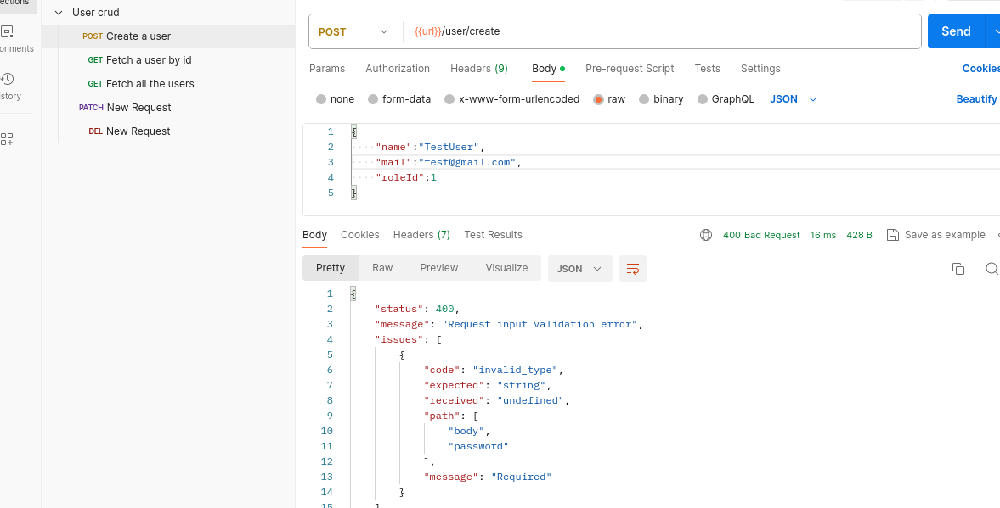
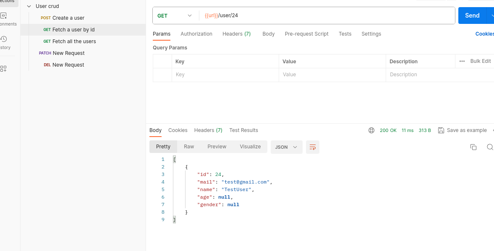
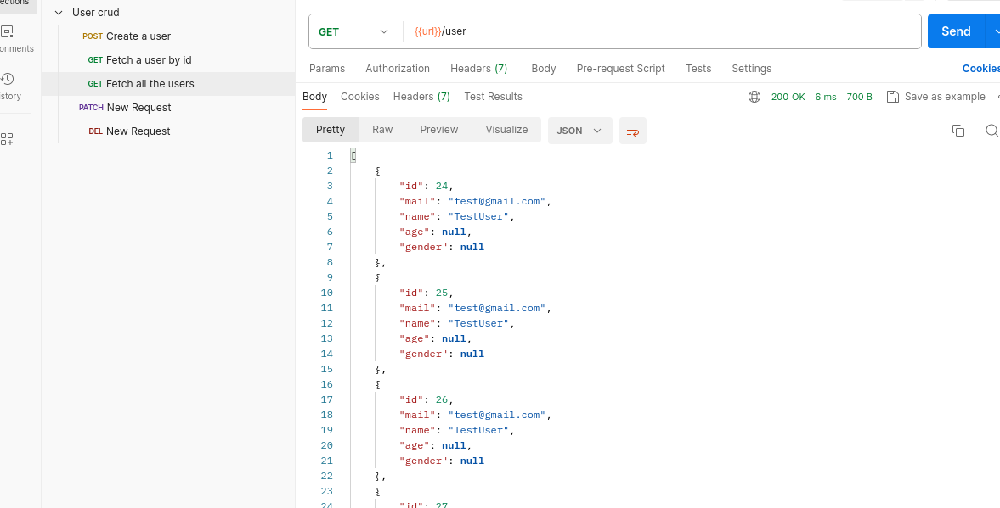
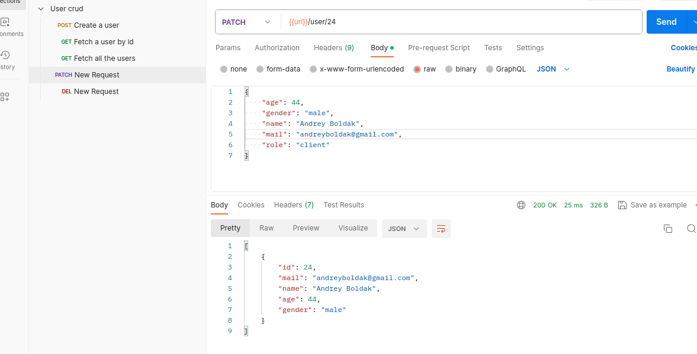
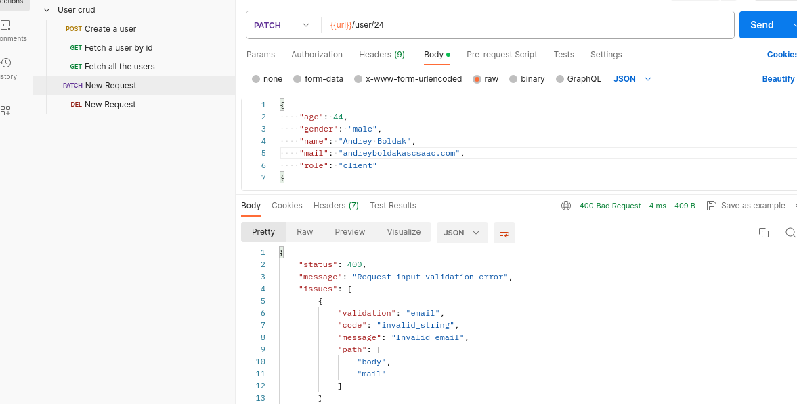
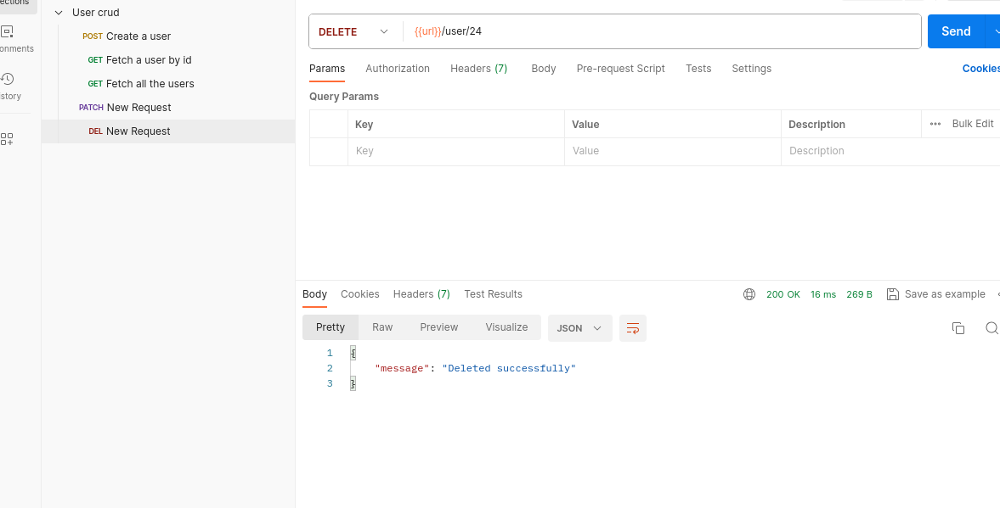

# Тестування працездатності системи

## Запуск системи

    

## Створення користувача

    

## Створення користувача з некоректним форматом даних

    

## Отримання користувача за id

    

## Отримання всіх користувачів

    

## Оновлення користувача

    

## Оновлення користувача з некоректним форматом даних

    

## Видалення користувача

    

